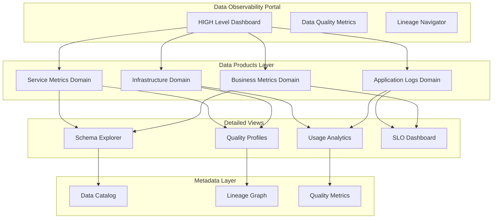

```mermaid
graph TB
    subgraph Portal["Data Observability Portal"]
        HL[HIGH Level Dashboard]
        DQ[Data Quality Metrics]
        LN[Lineage Navigator]
    end

    subgraph DataProducts["Data Products Layer"]
        DP1[Service Metrics Domain]
        DP2[Infrastructure Domain]
        DP3[Application Logs Domain]
        DP4[Business Metrics Domain]
    end

    subgraph Details["Detailed Views"]
        D1[Schema Explorer]
        D2[Quality Profiles]
        D3[Usage Analytics]
        D4[SLO Dashboard]
    end

    HL --> DP1
    HL --> DP2
    HL --> DP3
    HL --> DP4

    DP1 --> D1
    DP1 --> D2
    DP2 --> D2
    DP2 --> D3
    DP3 --> D3
    DP3 --> D4
    DP4 --> D4
    DP4 --> D1

    subgraph Metadata["Metadata Layer"]
        M1[Data Catalog]
        M2[Lineage Graph]
        M3[Quality Metrics]
    end

    D1 --> M1
    D2 --> M2
    D3 --> M3
```